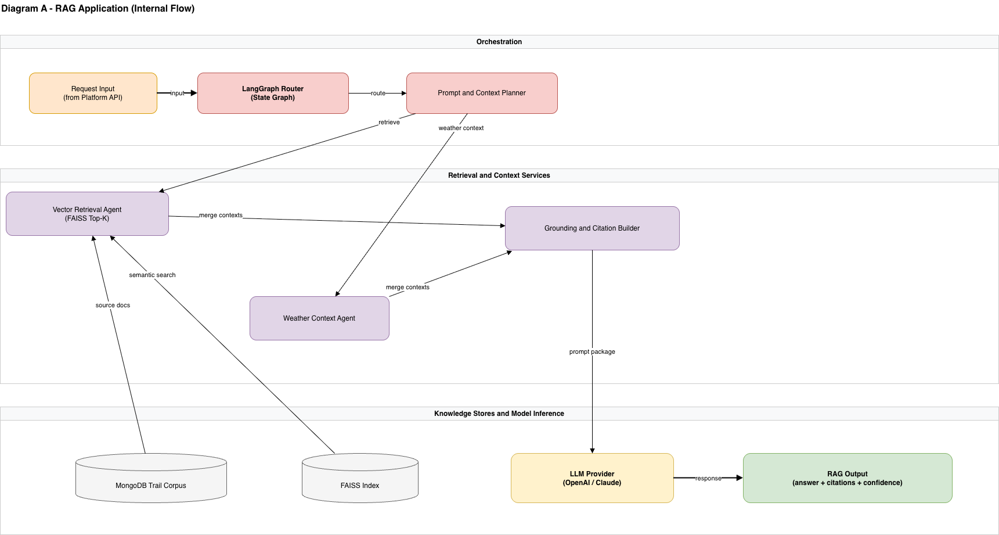
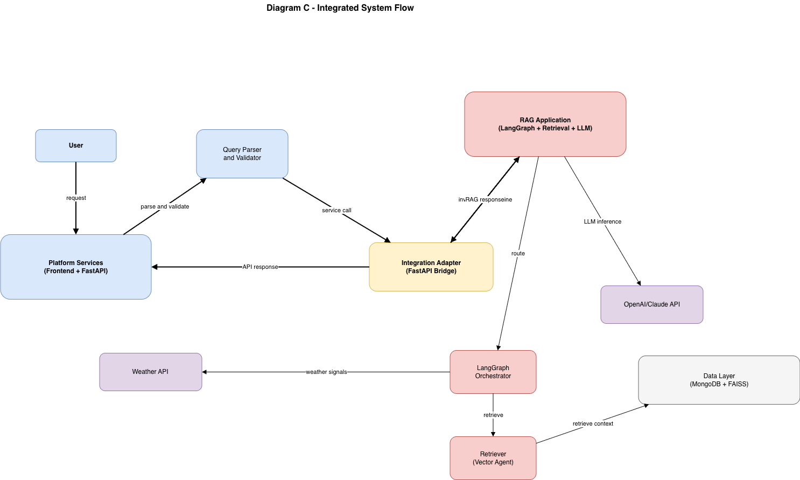

# TrailBlaze AI

> **AI-powered trail guidance for Colorado — combining real-time weather, live wildlife data, government trail geometry, and a conversational RAG pipeline to help hikers make smarter, safer decisions.**

---

## Overview

TrailBlaze AI is a full-stack outdoor intelligence platform built for Colorado hikers. It addresses a fundamental limitation of existing trail apps: static databases that cannot account for today's conditions. TrailBlaze integrates live weather forecasts, real-time wildlife observations, crowdsourced condition reports, and an AI chat assistant into a single, unified experience backed by over 5,600 government-sourced Colorado trails.

The system is built around a **Retrieval-Augmented Generation (RAG)** pipeline orchestrated with **LangGraph**, a **FastAPI** backend with async MongoDB access, and a **Next.js** frontend with an interactive **Leaflet** map. It is containerized with Docker and deployed on **AWS ECS Fargate** (backend) and **Vercel** (frontend).

---

## Architecture Diagrams

### Diagram A — RAG Application (Internal Flow)


> The RAG pipeline routes user queries through a LangGraph state machine: the LangGraph Router classifies intent, the Vector Retrieval Agent performs FAISS semantic search over 5,661 trail embeddings, the Weather Context Agent fetches live Open-Meteo data, and the Grounding and Citation Builder assembles a prompt for the LLM to produce a grounded, factual answer.

---

### Diagram B — Platform Services (UI, API, Data, Deployment)


> The platform services layer shows how the Next.js web app communicates with the FastAPI gateway, which routes requests to the chat/itinerary service and RAG invocation layer. The data engineering layer handles COTREX trail ingestion and ETL normalization into MongoDB. The delivery layer runs GitHub Actions CI/CD → Docker build → AWS deployment.

---

### Diagram C — Integrated System Flow


> The end-to-end integration view: user requests are parsed and validated, routed through the FastAPI bridge to the LangGraph orchestrator, which coordinates the Vector Retrieval Agent (FAISS + MongoDB), the Weather API, and the OpenAI LLM — returning a composed response back through the platform services layer to the user.

---

## Core Features

- **Conversational AI Chat** — Natural language queries answered by a 4-agent LangGraph pipeline (Router → Vector → Weather → Synthesizer) grounded strictly on retrieved trail data
- **Interactive Trail Map** — 5,600+ Colorado trails rendered as clustered pins on a Leaflet map with 4 switchable base layers, route polylines, isochrone drive-time filtering, and a crowd density heatmap
- **Live Weather Integration** — Real-time temperature, wind, snowfall, and 4-day forecast from Open-Meteo API at each trail's exact GPS coordinates, with weather-adjusted difficulty ratings
- **Wildlife Alerts** — iNaturalist research-grade species observations within 3km of each trail, updated in real time with photos and observation dates
- **TrailBlaze Score** — Custom multi-factor trail scoring based on distance, elevation, surface quality, weather safety, and review volume — surfaces quality over popularity
- **Crowdsourced Condition Reports** — Structured condition types (Clear, Muddy, Snow, Icy, Downed Tree, Washed Out) with a live global feed
- **Trail Detail Panel** — Elevation chart, AI narrative, crowd prediction, seasonal heatmap, NPS alerts, sunrise/sunset times, nearby trails, and similar trail recommendations — all loaded in parallel
- **Surprise Me** — One-click random trail discovery with an AI-generated tagline
- **Drive-Time Filter** — Isochrone polygon computed from any address, filtering the map to only reachable trails within a chosen drive duration
- **GPX Export, Itinerary Builder, Trail Comparison** — Additional planning tools built into the frontend

---

## Tech Stack

| Layer | Technology |
|---|---|
| Frontend | Next.js 15, React 19, TailwindCSS 4, Leaflet + markercluster |
| Backend | FastAPI, Python 3.11, Uvicorn, Pydantic v2, Motor |
| Database | MongoDB Atlas |
| AI / RAG | LangGraph, FAISS, OpenAI GPT-4o-mini, text-embedding-3-small, DistilBERT, HyDE, BM25 |
| Weather | Open-Meteo API (free, no key) |
| Wildlife | iNaturalist API (free, no key) |
| Trail Data | COTREX ArcGIS (Colorado state), NPS API |
| Geocoding | Nominatim / OpenStreetMap |
| Routing | OpenRouteService (isochrone) |
| Infrastructure | Docker, AWS ECR, AWS ECS Fargate, Vercel, GitHub Actions |

---

## External APIs

| API | Purpose | Key Required |
|---|---|---|
| Open-Meteo | Live weather + 4-day forecast per trail GPS | No |
| iNaturalist | Wildlife observations within 3km of trail | No |
| COTREX ArcGIS | Official Colorado trail geometry + trailheads | No |
| OpenAI | GPT-4o-mini (chat, synthesis), text-embedding-3-small (FAISS index) | Yes |
| NPS API | Live ranger alerts for national park trails | Yes (free) |
| Nominatim | Address geocoding for drive-time filter | No |
| OpenRouteService | Drive-time isochrone polygon computation | Optional |

---

## Project Structure

```
TrailBlaze-AI/
├── frontend/nextjs-app/        # Next.js 15 web application
│   └── src/
│       ├── app/                # Main page + layout
│       ├── components/         # TrailMap, TrailDetail, ChatPanel, TrailCards
│       └── lib/api.ts          # All backend API client functions
├── backend/
│   └── app/
│       ├── routes/             # trails, chat, weather, reviews, conditions, geometry, ...
│       └── services/           # scoring, crowd_predictor, wildlife_alerts, seasonal_analyzer
├── ai/
│   ├── langgraph/              # graph.py, agents.py, state.py
│   └── rag/                    # retriever.py (FAISS vector search)
├── data_engineering/           # Trail ingestion + ETL scripts
├── assets/Diagrams/            # Architecture diagrams (PNG + XML)
└── docs/                       # Project documentation
```

---

## Running Locally

**Backend**
```bash
cd backend
pip install -r requirements.txt
uvicorn app.main:app --reload --port 8000
```

**Frontend**
```bash
cd frontend/nextjs-app
npm install
npm run dev
# Visit http://localhost:3000
```

**AI Service**
```bash
cd ai
cp .env.example .env   # Add OPENAI_API_KEY
python -m langgraph.graph
```

> MongoDB Atlas connection string and OpenAI API key must be set in environment variables before starting the backend.

---

## Deployment

The backend is containerized with Docker and deployed via **GitHub Actions → AWS ECR → AWS ECS Fargate**. The frontend is deployed to **Vercel** automatically on every push to `main`. Rolling deployments ensure zero downtime on updates.

---

## Course Context

Developed as part of the **Big Data Analytics** course (Spring 2026) with a focus on real-time data integration, scalable async architecture, user safety through weather-aware advisories, and production-grade cloud deployment.
